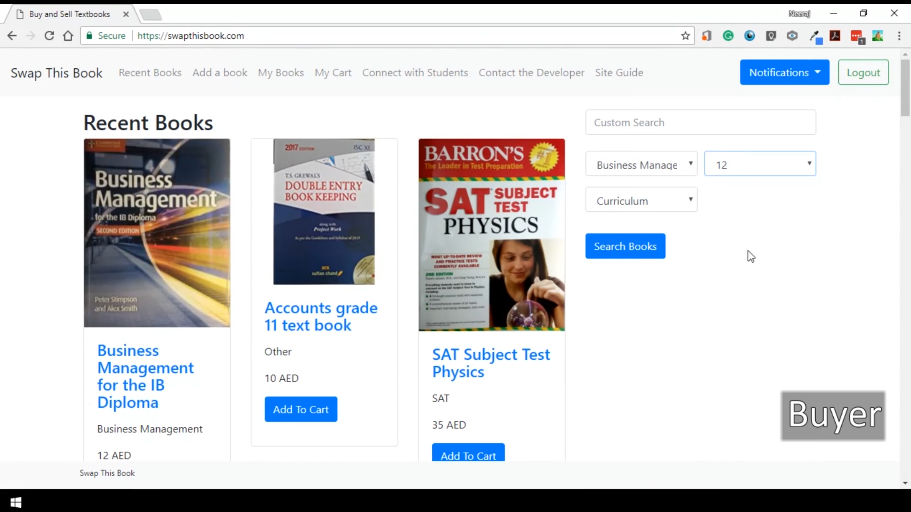

# Books For A Cause (Formerly "Swap This Book")

## The Problem

In my school, it is compulsory to buy the books that you are going to use for the academic year. These books are of no use to students once they pass that grade and they don’t know what to do with them. To put the books to good use, people post advertisements on Facebook detailing the books that they are putting on sale, but this current system is highly inefficient, and books seldom find new owners. This leads to many students giving their second-hand textbooks to the school library.

Every year, the school librarian receives a lot of used textbooks that graduating students no longer require, and these textbooks are useful for students that are promoted to the grade that requires these books. These books are in high demand because of the notes that students make on the textbook, and because purchasing another bunch of books can be avoided if there is no update to the syllabus. When I interviewed the librarian, she said that cataloging every textbook is an ordeal and distracts her from more important work. She asked me for a solution which could ease the process. 

## The Solution

After consultation, I suggested the creation of a website www.booksforacause.me, which could act as an online platform for the exchange of books. The sellers can upload images of their books along with all its details such as the title, relevant subject, intended grade, price, ISBN number, etc. Buyers can find books that they want with the use of search filters like grade and subject. The librarian will act as an administrator (through a subdomain of the website) and monitor the books being added to ensure that all the book details are appropriate and all the items are suitable for the website. If students try to exploit the system for their personal benefits (for example, adding comic books or spam products) she will be able to delete these items. This solution reduces the librarians work drastically and allows her to focus on more important work.

I made this computational solution in the form of a website because it would be easily accessible by all operating systems and I wouldn’t run into problems such as compatibility issues or multiple versions for Windows, Apple, and Android. A lot more people would be able to use the software if it were a website rather than a mobile or desktop application.

## Screenshots

### Landing Page

### Buyer Page

### Messaging Page

## Features
* Students can add books with relevant details and edit them later if necessary.
*	Students can easily search for books with filters such as ‘grade’ and ‘subject’.
*	The School librarian can monitor the books being added and approve, reject, or comment on the them. 
*	The School librarian can access a separate log in page to log in.
*	Students are notified when an event relevant to them occurs on the website.
*	A messaging section of the app allows students to exchange contact information and discuss the location of the exchange.
